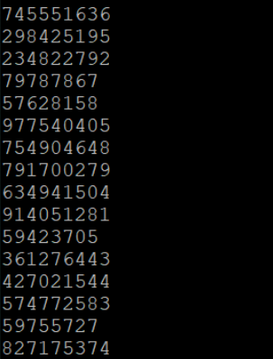
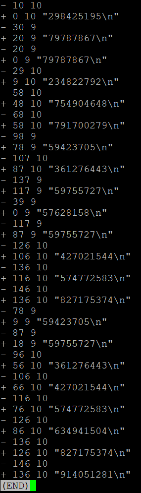
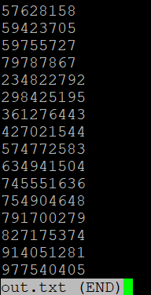

# Edit Buffer Data Structure
* Overview: Created an Edit Buffer program that can be used to support a text editing program. Edit Buffer was created using the Gap-Buffer data structure. Data can be read to and deleted from the edit buffer. Space is dynamically allocated for the buffer and the size will automatically be doubled if the buffer fills up. Cursor exists within the buffer can be controlled by user to navigate to and insert/delete from desired locations.
* Goals: Gain experience using Unix shell, writing and debugging a program with VIM, and test driven development.

### Prerequisites
* Familiarity with C
* Access to Unix shell

### Functions
* typedef struct STRUCT_EDIT_BUFFER_TAG SEditBuffer;

  ** The data structure that will be used to hold the data values for the Edit Buffer 

* SEditBufferRef EditBufferCreate();

  ** Creates an empty Edit Buffer and returns a reference to it.

* void EditBufferDestroy(SEditBufferRef ebuf);

  ** Destroys the Edit Buffer referenced by ebuf. 

* size_t EditBufferSize(SEditBufferRef ebuf);
  
  ** Returns the number of characters that are currently in the Edit Buffer. 

* size_t EditBufferMoveCursor(SEditBufferRef ebuf, int offset, int origin);

  ** Moves the cursor of the Edit Buffer. The origin will be one of the three values EDIT_BUFFER_ORIGIN_BEGINNING, EDIT_BUFFER_ORIGIN_CURRENT, or EDIT_BUFFER_ORIGIN_END representing that the offset should be relative to the beginning, current or end location. The offset from the beginning of the Edit Buffer is returned. 

* size_t EditBufferLoad(SEditBufferRef ebuf, const char *buf);

  ** Loads the Edit Buffer with the string specified by buf. The number of characters that are now in the Edit Buffer is returned.

* size_t EditBufferRead(SEditBufferRef ebuf, char *buf, size_t count);

  ** Attempts to read ‘count’ number of characters from the Edit Buffer into the buffer pointed to by buf. The beginning of the characters that are read into the buf start at the current cursor offset. The cursor is moved forward by the number of characters that are read. If more characters are requested than remain in the buffer after the cursor, the remaining number of characters are read. The actual number of characters read will be returned. 

* size_t EditBufferInsert(SEditBufferRef ebuf, const char *buf, size_t count);

  ** Inserts ‘count’ characters at the cursor location. The characters to be inserted should be pointed to by buf. The cursor is moved forward by the number of characters that were successfully inserted. The number of characters inserted will be returned.

* size_t EditBufferDelete(SEditBufferRef ebuf, size_t count);

  ** Deletes ‘count’ characters that are following the cursor location. The cursor is not moved. If fewer characters exist after the cursor in the Edit Buffer, all the remaining characters are removed following the cursor. The number of characters that were deleted will be returned. 

### Understanding the Data
* data_orig.txt

  ** Contains the unedited data that will be loaded into the buffer.
  
  
  
* data_edit.txt

  ** Contains all of the edits that are to be applied to the data in data_orig.txt
  
  

### Running the tests
* First, download the 'all_files' folder onto your machine.
* Next, from the shell, navigate your working directory so that you are within the 'all_files' folder.
* Finally, run the command: bin/proj2 data/data_orig.txt data/data_edit.txt > out.txt
  - The modified data will be saved to 'out.txt'
  
  
  
* You can continue using the Edit Buffer to make any changes to the data that you would like, or load your own data into the buffer and experiment with changes.
### Authors

* **William Schmidt** - [LikedIn](https://www.linkedin.com/in/william-schmidt-152431168/)
